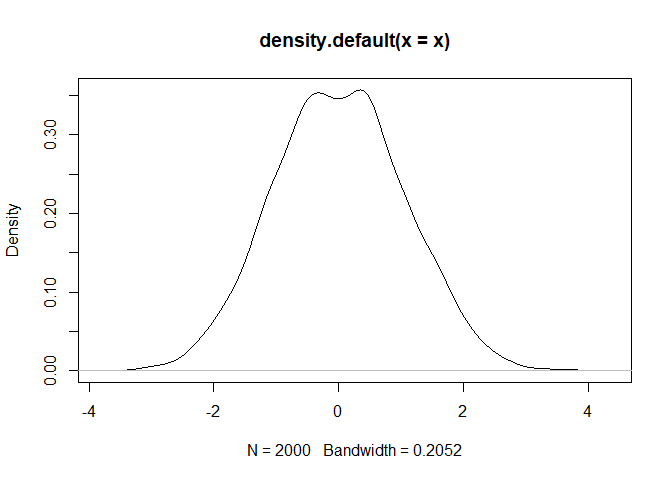

<!-- README.md is generated from README.Rmd. Please edit that file -->

# bootstrapRRust

<!-- badges: start -->

<!-- badges: end -->

The goal of bootstrapRRust is to simply demonstrate implementation of a
Rust function into R.

## Installation

You can install the development version from
[GitHub](https://github.com/jmbarbone/bootstrapRRust) with:

``` r
# install.packages("devtools")
devtools::install_github("jmbarbone/bootstrapRRust")
```

## Example

This is a basic example which shows you how to solve a common problem:

``` r
library(bootstrapRRust)
# run_benchmarks(x = rchisq(1000, 2), R = 2000)
```

``` r
a <- runif(200)
x <- bootstrap_r(a, 2000)
# y <- bootstrap_rs(a, 2000)

plot(density(x))
```



``` r
# lines(density(y))
```
