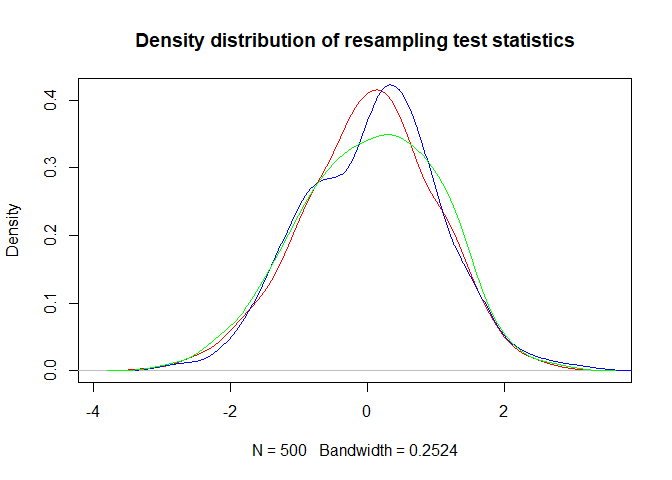

<!-- README.md is generated from README.Rmd. Please edit that file -->

# bootstrapRRust

<!-- badges: start -->

<!-- badges: end -->

The goal of bootstrapRRust is to simply demonstrate implementation of a
Rust function into R.

## Installation

You can install the development version from
[GitHub](https://github.com/jmbarbone/bootstrapRRust) with:

``` r
# install.packages("devtools")
devtools::install_github("jmbarbone/bootstrapRRust")
```

## Example

This is a basic example which shows you how to solve a common problem:

``` r
library(bootstrapRRust)
run_benchmarks(x = rchisq(2000, 2), R = 5000)
#> Unit: milliseconds
#>                  expr      min        lq      mean    median        uq
#>     bootstrap_r(x, R) 999.4483 1018.8229 1068.7365 1057.2921 1134.5837
#>  bootstrap_loop(x, R) 951.7566  990.5421 1035.7726 1026.9447 1067.4249
#>    bootstrap_rs(x, R) 217.0126  219.4481  234.2438  232.6049  242.7409
#>        max neval cld
#>  1151.3666    10   b
#>  1153.5765    10   b
#>   266.5841    10  a
```

``` r
a <- rpois(2000, 5)
x <- bootstrap_r(a, 500)
y <- bootstrap_rs(a, 500)
z <- bootstrap_loop(a, 500)

plot(density(x), col = "red", main = "Density distribution of resampling test statistics")
lines(density(y), col = "blue")
lines(density(z), col = "green")
```


