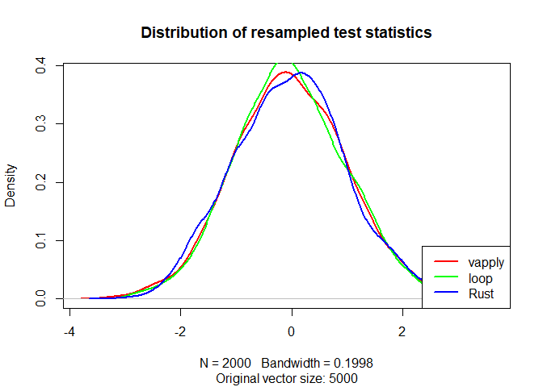

<!-- README.md is generated from README.Rmd. Please edit that file -->

# bootstrapRRust

<!-- badges: start -->

<!-- badges: end -->

The goal of bootstrapRRust is to simply demonstrate implementation of a
Rust function into R.

## Installation

You can install the development version from
[GitHub](https://github.com/jmbarbone/bootstrapRRust) with:

``` r
# install.packages("devtools")
devtools::install_github("jmbarbone/bootstrapRRust")
```

## Bootstrap benchmarks

``` r
library(bootstrapRRust)
run_benchmarks(x = rchisq(5000, 3), R = 2000)
#> Unit: milliseconds
#>    expr      min       lq     mean   median       uq       max neval cld
#>  vapply 806.7684 818.4216 854.7491 833.5918 881.6042 1000.0573    10   b
#>    loop 791.8361 801.4223 850.0727 824.7459 865.0181 1015.2215    10   b
#>    Rust 220.0761 226.7964 256.2649 251.2126 283.7543  311.2337    10  a
```

<details>

<summary>View session info</summary>

``` r
sessionInfo()
#> R version 4.0.0 (2020-04-24)
#> Platform: x86_64-w64-mingw32/x64 (64-bit)
#> Running under: Windows 10 x64 (build 18363)
#> 
#> Matrix products: default
#> 
#> locale:
#> [1] LC_COLLATE=English_United States.1252 
#> [2] LC_CTYPE=English_United States.1252   
#> [3] LC_MONETARY=English_United States.1252
#> [4] LC_NUMERIC=C                          
#> [5] LC_TIME=English_United States.1252    
#> 
#> attached base packages:
#> [1] stats     graphics  grDevices utils     datasets  methods   base     
#> 
#> other attached packages:
#> [1] bootstrapRRust_0.0.0.9000
#> 
#> loaded via a namespace (and not attached):
#>  [1] Rcpp_1.0.4.6         codetools_0.2-16     mvtnorm_1.1-0       
#>  [4] lattice_0.20-41      zoo_1.8-8            digest_0.6.25       
#>  [7] MASS_7.3-51.5        grid_4.0.0           magrittr_1.5        
#> [10] evaluate_0.14        rlang_0.4.6          stringi_1.4.6       
#> [13] multcomp_1.4-13      Matrix_1.2-18        rmarkdown_2.1       
#> [16] sandwich_2.5-1       TH.data_1.0-10       splines_4.0.0       
#> [19] tools_4.0.0          stringr_1.4.0        survival_3.1-12     
#> [22] xfun_0.14            yaml_2.2.1           compiler_4.0.0      
#> [25] microbenchmark_1.4-7 htmltools_0.4.0      knitr_1.28
```

</details>

## Graph results

``` r
main_plot()
```


